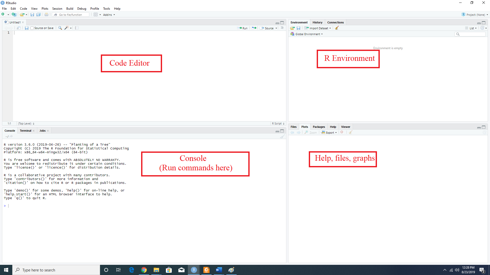

```{r setup, include=FALSE}
knitr::opts_chunk$set(echo = FALSE)
```


## Getting Started
- The source codes and necessary documentations are available at the repository: (https://github.com/mdtuhinsheikh/introR_ucsas2019).
- The workshop slides are available at the [link](https://github.com/mdtuhinsheikh/R_Intro_UCSAS2019).
- Prerequisites: 
  + [R](https://cran.r-project.org/) and [Rstudio](https://www.rstudio.com/products/rstudio/download/#download) have been installed.

## About Me
- Third year Ph.D. Student in Statistics, UConn.
- Research Interests:
  + Bayesian biostatistics
  + Modelling informative dropout process
  + Machine learning and deep learning
  + Microbiome data analysis
- Future goals: 
  + Contribute to the broader field of biostatistics and statistical learning.

## Assumption about the audience
- Have little to no experience with R.
- Enthusiastic attitude towards learning R programming.
  
## Aims of the Workshop
- By the end of this workshop, the participants should have a basic understanding of
  + What R can do and whether you want to use it in the future
  + The ecosystem of R programming
  + Data structure and basic R functions
  + Import, export, and data management using R

## Outline
- R Basics
- File System and Data Structure
- Read and Write Data
- Data Management
- Brief overview of "dplyr" package

## What is R?
- R is a free software environment for statistical computing and graphics
- R is a full-featured statistical analysis package (like SAS, SPSS, etc.) that allows to:
  + import, export, and manipulate data
  + represent data graphically
  + analyse and report
- Why the Name "R"?
  + Initial of the names of two originators: Ross Ihaka and Robert Gentleman
- More details: <https://www.r-project.org>.

## Why R?
- R is completely free to use and is an open source
- R is compatible with major operating systems (e.g. Windows, macOS, Linux).
- R has a huge library of user-contributed packages with
  + frequent release and
  + active development
- R is flexible to use
- Popular in academia and industry
- R makes data analysis fun!

## Coupling R with RStudio
- RStudio is an integrated development environment for the R programming language.
- Let us introduce with the RStudio interface.

## RStudio interface
{width=950px}


## R as a calculator
```{r echo=TRUE, eval=FALSE}
5+7                          # 12

exp(5)                       # 148.4132   

log(2)                       # 0.6931472
```

## Ask for help?
- If you know the exact name of the function, then try **`?function_name`**, e.g.,\
```{r echo = TRUE, eval = FALSE}
?mean                       # Search mean function
```
- If you know specific words then **`help.search("text")`**, e.g.,\
```{r echo = TRUE, eval = FALSE}
help.search("print") 
```
- If you do not know the exact function names, **Google** search engine or **Stack Overflow** are always excellent resources.


## Assigning operator
- We can assign values to a variable in R by using `<-` or `=` or `->`. For example,
```{r, echo = TRUE, eval = FALSE}
x <- "Hello World"
x                 # [1] "Hello World"
x = 5
x                 # [1] 5
5 -> x
x                 # [1] 5
```

## Assigning operators cont...
- For combining elements or creating vectors, we can use `c()` and `[]` is used for subsetting and indexing.
```{r echo = TRUE, eval = FALSE}
x <- c(2, 5, 8)       # [1] 2 5 8
x[2]                  # [1] 5
x[1:2]                # [1] 2 5
x[1]**2               # [1] 4
exp(x)                # [1]    7.389056  148.413159 2980.957987
x[1] %% 2             # [1] 0
x[1] == 2             # [1] TRUE
x[1] < 2              # [1] FALSE
x[1] != 2             # [1] FALSE
```


## Some useful R functions
- For atomic operators:
```r
vector(), length(), names(), setNames(), rep(), rep.int(), rep_len(),
seq(), seq.int(), seq_len(), seq.along(), %in%, match(), rev(), head(), 
tail(), paste(), paste0(), typeof(), is.character(), as.character(), 
is.numeric(), as.numeric(), is.logical(), as.logical(), ...
```
- **Quiz:** Let us try `?rep` to get to know about this function and then use this function to print {1 2 3 1 2 3} and {1 1 2 2 3 3}.

```{r echo = TRUE, eval = FALSE}
rep(c(1, 2, 3), times = 2)                 # 1 2 3 1 2 3
rep(c(1, 2, 3), each = 2)                  # 1 1 2 2 3 3
```

## Some useful R functions cont...
- For ordering and subsetting:
```r
sort(), order(), rank(), quantile(),
duplicated(), unique(),
table(), split(), cut().
```

## Some useful functions cont...
- **Quiz:** Consider we have $x = (5, 5, 3, 3, 10, 20)$
  + Length of this vector? 
  + What are the unique values of $x$
  + Sort the values of $x$
  + Frequency distribution of $x$
  
## Quiz solution
```{r echo = TRUE, eval = FALSE}
x <- c(3, 3, 5, 5, 10, 20)  
length(x)        # 6
unique(x)        # 5 3 10 20
sort(x)          # 3 5 10 20 
table(x)         # 3 5 10 20 
                 # 2 2  1  1 
```

## Basic R data structure

- The common forms of data types are as follows:

|  Data Type  | Also know as   | Example                      |
|-------------|-----------------|------------------------------|
| Numeric     | float           | 42, 3.14, -19.2              |
| Character   | string or text  | “a”, “block1”, "red", “John” |
| Logical     | boolean         |       TRUE, FALSE            |

- Basic R data structures are
  + 1d: vector or list
  + 2d: matrix or data frame
  + nd: array
  
## Basic R data structure cont...
- **Vector:** a single entity consisting of a collection of numbers or characters.
  + The vector index can used by `[]`.
```{r echo = TRUE, eval = FALSE}
x <- c(10.4, 5.6, 3.1, 6.4, 21.7)
x[2]          # Second element 5.6
```

- **List:** can list vectors or elements with unequal dimension or different data types.
   + The indexing for list can be used by `[[]]`.
```{r echo = TRUE, eval = FALSE}
x <- list(c(1, 2), c(5, 8, 9))
x[[1]]        # [1] 1 2
x[[2]]        # [1] 5 8 9
```

## Basic R data structure cont...
- **Array**: multiply subscripted collection of data entries
```{r echo = TRUE, eval = FALSE}
x <- array(1:12, dim = c(3,2,2))
x[ , , 1] ##      [,1] [,2]
          ## [1,]    1    4
          ## [2,]    2    5
          ## [3,]    3    6
```

- **Matrix:** two-dimensional array
```{r echo = TRUE, eval = TRUE}
x <- matrix(1:6, nrow = 2)
x
```

## Basic R data structure cont...
- Let us learn arithmatic operations of matrix by solving the following quiz
- **Quiz:** Let $A = \begin{bmatrix} 1 & 2 \\ 3 & 4  \end{bmatrix}$ and $B = \begin{bmatrix} 10 & 20 \\ 30 & 40  \end{bmatrix}$. 
  + What are the dimensions of $A$ and $B$?
  + Find the determinant of $A$ and $B$.
  + Evaluate $AB$, $A^{-1}$, and $B^{-1}$.
  
## Quiz solution
- What are the dimensions of $A$ and $B$?
```{r echo = TRUE, eval = FALSE}
A <- matrix(c(1, 2, 3, 4), ncol = 2, byrow = TRUE)
B <- matrix(c(10, 20, 30, 40), ncol = 2, byrow = TRUE)

dim(A)
dim(B)
```
- Find the determinant of $A$ and $B$.
```{r echo = TRUE, eval = FALSE}
det(A)
det(B)
```
## Quiz solution cont...
- Evaluate $AB$, $A^{-1}$, and $B^{-1}$.
```{r echo = TRUE, eval = FALSE}
A %*% B
solve(A)
solve(B)
```


## Functions
- Basic Structure:
```{r echo = TRUE}
function_name <- function(arguments) {
  # Some operation
}
```
- Example: function of evaluating absolute value
```{r echo = TRUE, eval = FALSE}
find_abs <- function(x) {
  if (x > 0) {
    return(x)
  }
  x * -1
}
find_abs(-5)       # 5
```

## Quiz
- Write a function that takes $x$ and $y$ as input and evaluates $x^y$.

## Quiz solution
```{r echo = TRUE, eval = FALSE}
pow <- function(x, y) {
  result <- x^y
  return(result)
}
pow(2, 3)            # 8
```

## Loop and condition
- If we want to repeat a task, we can use **for**, **while**, etc. statements.
```{r echo = TRUE, eval = FALSE}
for(i in 1:5){
  index <- i
  print(index)
}

i=1
while(i <= 5){
  index <- i
  print(index)
  i = i + 1
}
```


## Loop and condition cont...
- Useful arithmatic operators and R syntax

| Operation   |  Syntax               |
|-------------|-----------------------|
|$x \neq 5$   |  x != 5               |
|$x = 5$      |  x == 5               |
|$x < 5$      |  x < 5                |
|$x \leq 5$   |  x <= 5               |
|$x > 5$      |  x > 5                |
|$x \geq 5$   |  x >= 5               |

## Loop and condition cont...
- When we want to control how the program should work, we use **if** statement.
```{r echo = TRUE, eval = FALSE}
for(i in 1:5){
  if(i != 2){
    index <- i
    print(index)
  }
}
```
- Loop and conditioning can always be significant component of a R function.

## Quiz 
- Is matrix multiplication $AB$ possible? Use the same $A = \begin{bmatrix} 1 & 2 \\ 3 & 4  \end{bmatrix}$ and $B = \begin{bmatrix} 10 & 20 \\ 30 & 40  \end{bmatrix}$. Write an R program using **if** condition. 
```{r echo = TRUE, eval = FALSE}
A <- matrix(c(1, 2, 3, 4), ncol = 2, byrow = TRUE)
B <- matrix(c(10, 20, 30, 40), ncol = 2, byrow = TRUE)

dim(A)
dim(B)

if (dim(A)[2] == dim(B)[1]){
  print("The multiplication is possible")
} else {
  print("The multiplication is not possible")
}
```

## Installing and loading packages
- Basic syntax: 
  + install a package: 
```{r echo = TRUE, eval = FALSE}
install.packages("package_name")
```
  + load a package: 
```{r echo = TRUE, eval = FALSE}
library("package_name")
```
- Example: install and load "Lahman" package
```{r echo = TRUE, eval = FALSE}
install.packages("Lahman")
library(Lahman)
```

## Searching datasets in a package
- Basic syntax: 
```{r echo = TRUE, eval = FALSE}
data(package = "package_name")
```
- Example:
```{r echo = TRUE, eval = FALSE}
data(package = "Lahman")
```

## Read and write data from/to local directory
- Read data syntex:
```{r echo =TRUE, eval = FALSE}
read.table(file = "location_of_file", header = TRUE)
```
- Write or save data syntex:
```{r echo =TRUE, eval = FALSE}
write.table(dataName, file = "location_of_file")
```
- Some of the useful functions for reading and writing data
```{r echo =TRUE, eval = FALSE}
read.csv(), read.csv2(), write.csv(), write.csv2(), etc.
```

## Read data from a package
- We already know how to search a dataset in a package
- To read a particular data from the package
```{r echo = TRUE, eval = FALSE}
data("dataName", package = "package_name")
```
- Quiz: Read "Batting" data from "Lahman" package

## Read data from package cont...
```{r echo = TRUE, eval = FALSE}
data("Batting", package = "Lahman")
# the data will be loaded if no error shows
```
- To learn about the variables
```{r echo = TRUE, eval = FALSE}
str("Batting")
#'data.frame':	105861 obs. of  22 variables:
# $ playerID: chr  "abercda01" "addybo01" "allisar01" "allisdo01" ...
# $ yearID  : int  1871 1871 1871 1871 1871 1871 1871 1871 1871 ...
# $ stint   : int  1 1 1 1 1 1 1 1 1 1 ...
# $ teamID  : Factor w/ 149 levels "ALT","ANA","ARI",..: 136 111 39 ...
# $ lgID    : Factor w/ 7 levels "AA","AL","FL",..: 4 4 4 4 4 4 4 4 ...
# $ G       : int  1 25 29 27 25 12 1 31 1 18 ...
# $ AB      : int  4 118 137 133 120 49 4 157 5 86 ...
# $ R       : int  0 30 28 28 29 9 0 66 1 13 ...
# $ H       : int  0 32 40 44 39 11 1 63 1 13 ...
#...
```

## Read data from package cont...
- More detailed description of the variables can be found at the [link](https://rdrr.io/cran/Lahman/man/Batting.html).
- Using this example we will learn data frame and data management.
- Display few rows of the data
```{r, echo = TRUE, eval = FALSE}
head(Batting)
#   playerID yearID stint teamID lgID  G  AB  R  H X2B X3B HR RBI ...
# 1 abercda01   1871     1    TRO   NA  1   4  0  0   0   0  0   0 ...
# 2  addybo01   1871     1    RC1   NA 25 118 30 32   6   0  0  13 ...
# 3 allisar01   1871     1    CL1   NA 29 137 28 40   4   5  0  19 ...
# 4 allisdo01   1871     1    WS3   NA 27 133 28 44  10   2  2  27 ...
# 5 ansonca01   1871     1    RC1   NA 25 120 29 39  11   3  0  16 ...
# 6 armstbo01   1871     1    FW1   NA 12  49  9 11   2   1  0   5 ...
```

## Basics of dataframe using Batting data
- Indexing works similar to matrix
```{r echo = TRUE, eval = FALSE}
Batting[, 1:4]
#    playerID yearID stint teamID
# 1 abercda01   1871     1    TRO
# 2  addybo01   1871     1    RC1
# 3 allisar01   1871     1    CL1
# 4 allisdo01   1871     1    WS3
# 5 ansonca01   1871     1    RC1
# 6 armstbo01   1871     1    FW1
# ...
```

## Basics of dataframe using Batting data cont...
- We can also display or work with variable(s) by using **\$** or mentioning the name of variable inside the indexing.
```{r echo = TRUE, eval = FALSE}
Batting$playerID
Batting[, c("playerID")]
# Displayes all rows of playerID variable
Batting[1:10, c("playerID", "yearID")]
# Displayes 10 rows of playerID and yearID variables
```

## Basics of dataframe using Batting data cont...
- Create new variable
```{r echo = TRUE, eval = FALSE}
Batting$CS_SO <- with(Batting, CS + SO)
head(Batting[, c("CS", "SO", "CS_SO")])
#   CS SO CS_SO
# 1  0  0     0
# 2  1  0     1
# 3  1  5     6
# 4  1  2     3
# 5  2  1     3
# 6  1  1     2
```
## Quiz on Batting data
- Display data from 1871 only
- Find the frequency of unique number of players, teams, and year information
- Create a separate dataframe for year 1872 only.

## Quiz solution
- Conditioning on the dataframe
```{r echo = TRUE, eval = FALSE}
Batting[Batting$yearID == "1871", ]   # Displays data from 1871 only
# Displays data for aardsda01 from 1871
Batting[Batting$yearID == "1871" & Batting$playerID == "aardsda01", ]   
```
- Unique number of players, teams, and year information:
```{r echo = TRUE, eval = FALSE}
length(unique(Batting$playerID))        # [1] 19428
length(unique(Batting$teamID))          # [1] 149
length(unique(Batting$yearID))          # [1] 148
```

## Quiz solution cont...
- Alternative way: using **apply()** function
```{r echo = TRUE, eval = FALSE}
apply(Batting, 2, function(x) {length(unique(x))})
# playerID   yearID    stint   teamID ...
#    19428      148        5      149 ...
```
- Create new dataframe
```{r echo = TRUE, eval = FALSE}
Batting_1872 <- Batting[Batting$yearID == "1872", ]
```

## Data management using "dplyr" package
- Requirements
```{r echo = TRUE, eval = FALSE}
install.packages("dplyr")
library(dplyr)
```
- Let us read "Salary" data from "Lahman" package
```{r echo = TRUE, eval = FALSE}
data("Salaries", package = "Lahman")
head(Salaries)
#   yearID teamID lgID  playerID salary
# 1   1985    ATL   NL barkele01 870000
# 2   1985    ATL   NL bedrost01 550000
# 3   1985    ATL   NL benedbr01 545000
# 4   1985    ATL   NL  campri01 633333
# 5   1985    ATL   NL ceronri01 625000
# 6   1985    ATL   NL chambch01 800000
```

## Data management using "dplyr" package cont...
- Let us create a subset of "Salary" data without "lgID"
```{r echo = TRUE, eval = FALSE}
salaries <- Salaries %>%
             select(playerID, yearID, teamID, salary)
head(salaries)
#    playerID yearID teamID salary
# 1 barkele01   1985    ATL 870000
# 2 bedrost01   1985    ATL 550000
# ...
```

## Data management using "dplyr" package cont...
- We want to add salary info of the players in our Batting data
```{r echo = TRUE, eval = FALSE}
batting <- left_join(Batting, salaries, 
                by =c("playerID", "yearID", "teamID"))
```
- Mean salary
```{r echo = TRUE, eval = FALSE}
mean(batting$salary, na.rm =  TRUE)
```

## Data management using "dplyr" package cont...
- Arrange the data with respect to multiple variables in order
```{r echo = TRUE, eval = FALSE}
batting <- batting %>% arrange(playerID, yearID, stint)
#   playerID yearID stint teamID lgID  ...  salary
#1 aardsda01   2004     1    SFN   NL  ...  300000
#2 aardsda01   2006     1    CHN   NL  ...   NA
#3 aardsda01   2007     1    CHA   AL  ...  387500
#4 aardsda01   2008     1    BOS   AL  ...  403250
#5 aardsda01   2009     1    SEA   AL  ...  419000
#6 aardsda01   2010     1    SEA   AL  ...  2750000
```
## Quiz
- Filter the data with eiligible players after the year 1899 and with a minimum of 20 base on balls.
- Arrange the eligible players by decreasing order of base on balls.

## Quiz solution
- Filter the data with eiligible players after the year 1899 and with a minimum of 20 base on balls
```{r echo = TRUE, eval = FALSE}
eligibleHitters <- batting %>%
                     filter(yearID >= 1900 & BB > 20)
```

## Quiz solution cont..
- Arrange the eligible players by decreasing order of base on balls.
```{r echo = TRUE, eval = FALSE}
goodPlayers <- eligibleHitters %>%
                     arrange(desc(BB))
```

## Useful References
- [R Programming for Data Science](https://bookdown.org/rdpeng/rprogdatascience/) by Roger D. Peng.
- [An Introduction to R](https://cran.r-project.org/doc/manuals/r-release/R-intro.pdf) by W. N. Venables, D. M. Smith
and the R Core Team.
- [Advanced R](http://adv-r.had.co.nz/) by Hadley Wickham.

## Thanks
- Good luck with coding R.
- Feel free to contact for further queries: mdtuhin.sheikh@uconn.edu.


